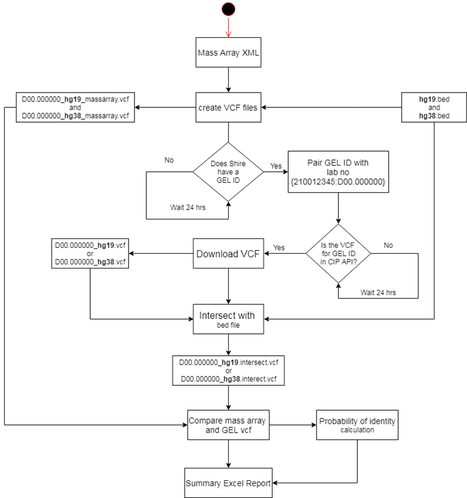

# Generate and Upload SNP VCF files to NGIS

## Set-up

Clone the repository. Create a copy of the example_config.txt file called config.txt and fill in the specified variables with the required settings:

- tenant_id, client_id and client_secret: Used for authentication.
- xml_path: path the the MassARRAY xml output directory. The script will attempt to generate SNP VCF files for all .xml files stored in this location. Within this path there needs to be directories named "processed" and "failed_to_process". The XML files will get moved to these directories depending on how they are processed.
- vcf_path: path to location where VCF files get written to. Within this path there needs to be directories named "not_uploaded", "uploaded", and "upload_failed". The VCF files will get moved to these directories depending on how they are processed.
- log_file: path to the log file.
- snp_host: API endpoint for snp uploading (currently https://samplematchservice-gms-beta.genomicsengland.nhs.uk)
- bed_file: path to bed file for SNP positions. Currently using bed_files/hg38.sorted.bed (build 38 is being used for GMS).

## Run the script:

python generate_and_upload_snp_vcf.py

The script will automatically generate and upload the VCFs to the required location. The scripts expects the MassARRAY samples to be named using the following convention:

d-number_referralID_participantID_LSID

The referral ID, participant ID and LSID are extracted from the sample name to determine the upload location for the sample.
All activity is recorded in the log file. This must be reviewed to monitor the outcomes of the file uploads. 

# IdentityCheck
(Not required for GMS activities as the ID check is performed by Genomics England)

## Comparison Workflow

### Identity probabilities and power calculations
The probability of identity (PI) is an estimate of the average probability that 2 independent samples will have the same genotype (_Waits, et.al., 2001_):

where pi is the allele frequency at the ith allele.

The exclusion power is defined as the probability of having a unique assignment and is calculated as follows:

Waits, Lisette & Luikart, Gordon & Taberlet, Pierre. (2001). Estimating the probability of identity among genotypes in natural populations. _Molecular Ecology Notes 10(1)_

### Results
N.B. results of validation run can be found on the P: drive at P:/100K_vcfs/results
